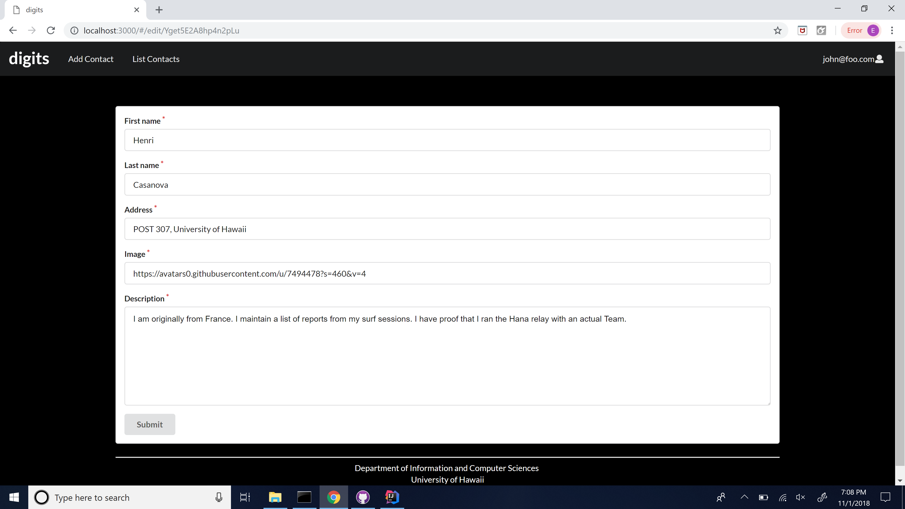

<h2>Installation</h2>

<a href="https://github.com/Edward-Yi/digits">Download digits </a> and <a href="https://www.meteor.com/install">install meteor</a>

Open command prompt and cd into the app directory

Install the required libraries with: <strong>meteor npm install</strong>

Run the app with: <strong>meteor npm run start</strong>

<strong>Regarding the bcrypt warning:</strong> installing bcrypt is more difficult than the prompt shows. And, it is safe to ignore this warning in the initial stages of development.

<h2>Pages Walkthrough</h2>

<h3>Landing page</h3>

This is the first page that you see on your first startup. It has a brief introduction of what Digits is capable of.

<h3>Register</h3>

Users can register, if they do not have an account, by clicking "Login" on the top right, then "Sign Up" from the dropdown.

<h3>Sign in</h3>

Users that have an account can click on "Login", then "Sign in"

<h3>Home page</h3>

Once logged into an account, the landing page will have additional options in the navigation bar, "Add Contact" and "List Contacts".

<h3>Add Contact</h3>

By clicking on "Add Contact" in the navigation bar brings the user to a page with a form to fill out, clicking submit to add a contact to their list. The add will fail if there are any empty fields.

<h3>List Contacts</h3>

Clicking on "List Contacts", the user is redirected to a page with a list of contacts that are associated to the user.

You can also add timestamped notes, under the contact you want to add the note to.

<h3>Edit Contacts</h3>

Clicking on "Edit", under the contact will bring up a form page, similar to "Add Contact", that is filled with the contact's initial information. Changing parts of the form and clicking submit will change the contents of the contact in "List Contact" and you are redirected to that page.

<h3>Admin</h3>

Admins have the "Admin" available to them in the navigation bar, users must have the Admin role. It lists all contacts and which users they are associated with.

